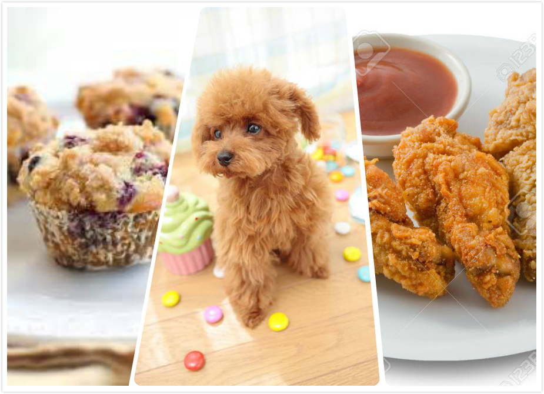
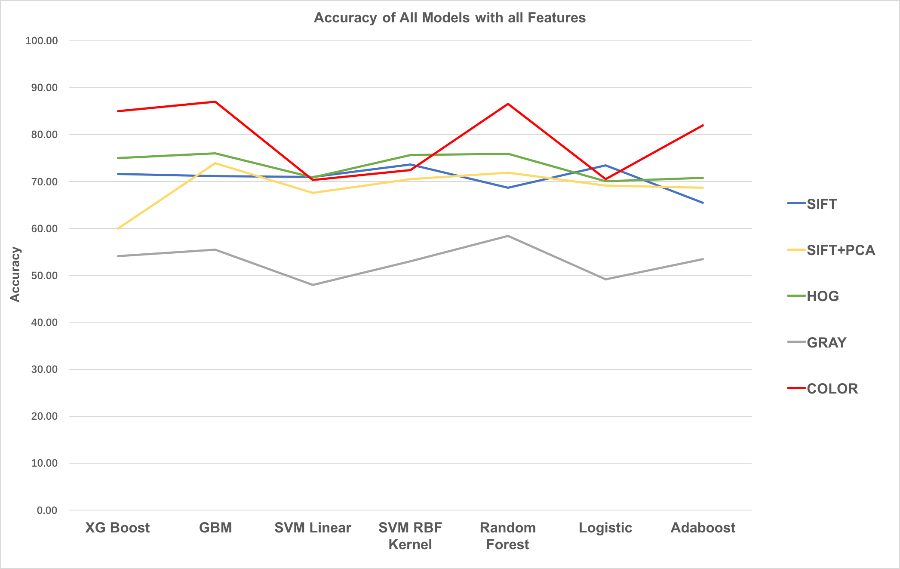
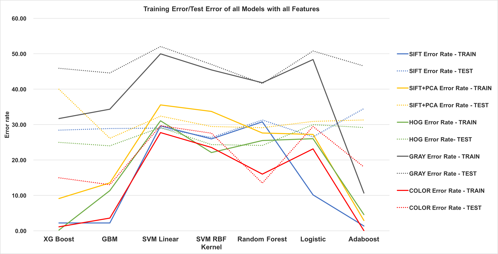
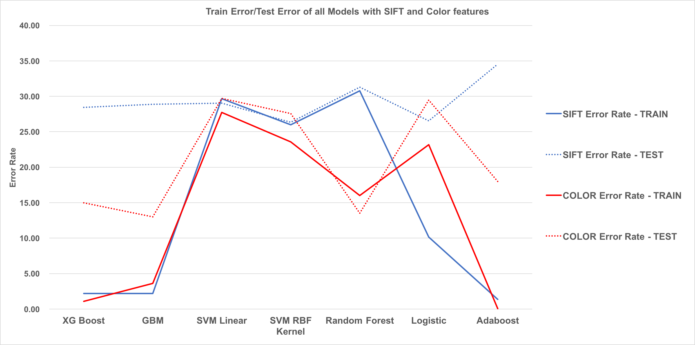

# Project 3: Dogs, Fried Chicken or Blueberry Muffins?


### [Full Project Description](doc/project3_desc.md)

Term: Spring 2018

+ Team #7
+ Team members
   + Chandak, Anshuma [ac4258@columbia.edu]()
   + Huang, Yuexuan [yh2966@columbia.edu]()
   + Li, Xinrou [xl2685@columbia.edu]()
   + Liu, Fangbing [fl2476@columbia.edu]()
   + Yan, Xiuruo [xy2358@columbia.edu]()

+ Project summary: In this project, we created a classification engine for images of dogs versus fried chicken versus blueberry muffins. Our Client is using a classification engine using boosted decision stumps on SIFT features. Our task is to propose a feasible improvement in client’s current practice to distinguish pictures of dogs (poodles and Chihuahuas), fried chicken and blueberry muffins. We were given a training set of 3000 images to train a new model. Our proposed model is using Gradient Boosting Machines on Color (RGB + HGV) features. The model leads to 13 percent error rate, with a running time of 0.86 seconds. This is a huge improvement from the Client's original model, which had an error rate of ~29 % .

The following charts give an exhaustive visual understanding of the performance of all the models we used using the different features we extracted.

 




References used:  
1. https://rpubs.com/mharris/multiclass_xgboost : Perform XGBoost  
2. https://en.wikipedia.org/wiki/AdaBoost : Perform Adaboost  
3. http://r-statistics.co/Logistic-Regression-With-R.html : Perform Logstic  
4. http://www.milanor.net/blog/cross-validation-for-predictive-analytics-using-r/ : CV error  
5. https://cran.r-project.org/web/packages/gbm/gbm.pdf;
   https://github.com/TZstatsADS/Fall2017-project3-grp3: Perform GBM  
6. https://perso.math.univ-toulouse.fr/motimo/files/2013/07/random-forest.pdf: Perform Random Forest  
7. https://cran.r-project.org/web/packages/randomForest/randomForest.pdf: Perform Random Forest  
8. https://www.pyimagesearch.com/2014/11/10/histogram-oriented-gradients-object-detection/ 
   https://github.com/TZstatsADS/Fall2017-project3-grp9/blob/master/lib/hog_features.R: HOG 
9. https://github.com/TZstatsADS/Fall2017-project3-grp8/blob/master/lib/svm/linear%20svm.Rmd: SVM. 
10. https://github.com/TZstatsADS/Fall2017-project3-grp9/blob/master/lib/color_features.R : Color feature


Following [suggestions](http://nicercode.github.io/blog/2013-04-05-projects/) by [RICH FITZJOHN](http://nicercode.github.io/about/#Team) (@richfitz). This folder is orgarnized as follows.

```
proj/
├── lib/
├── data/
├── doc/
├── figs/
└── output/
```

Please see each subfolder for a README file.
 
